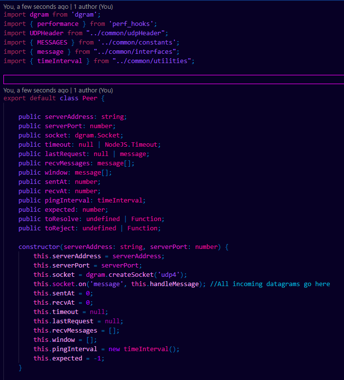
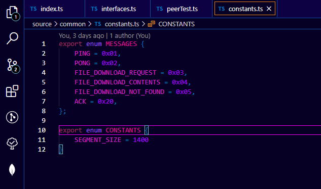
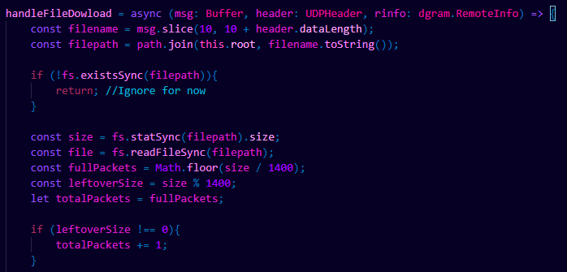

# Pinker

Pinker is a high contrast, dark theme, revolving around shades of pink / purple, with hints of blue.

The theme is currently optimized only for Typescript / Javascript. These colors are based on my preferences. I couldn't find a theme I liked with the color preferences too, so I decided to make my own instead.

The foreground is a shade of blue, with comments almost cyan. Constants, literals and keywords are varying shades of pink / purple. 

Current active line is outlined in a bright pink.

Check out the screenshots as well!

# Screenshots

## Class definition

## Enum

## Functions

